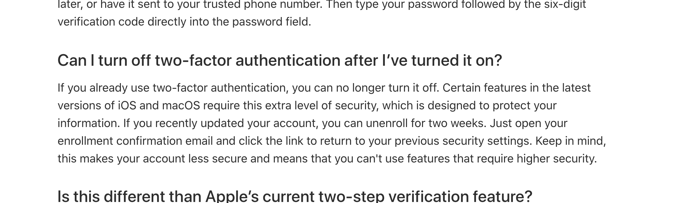

I recently did a security audit of my personal online presence and was shocked to find that Apple [now makes it mandatory](https://support.apple.com/en-us/HT204915) to keep your SMS-based two factor authentication after initially enabling it. Yes, that means that if the guy at the Verizon store [decides to hand out a new sim card](https://www.coindesk.com/crypto-investor-awarded-over-75-million-in-sim-swapping-hack-case) registered with your phone number to a fraudster, someone will have a great day [at your expense](https://krebsonsecurity.com/2019/01/stole-24-million-but-still-cant-keep-a-friend/).

At this point it's fairly common knowledge that [phone numbers stink as identity proof](https://krebsonsecurity.com/2019/03/why-phone-numbers-stink-as-identity-proof/). The countless cases of sim-swapping incidents, primarily targeting cryptocurrency investors, are a visceral example of why we need to stop requiring SMS-based TFA. Google suite even [has a guide](https://gsuiteupdates.googleblog.com/2019/03/more-control-over-2-step-verification-security-phone-sms.html) for admins to disable SMS and voice codes on their company domains to curb this issue. 

Sure, for the most part, phone-based-TFA is very enticing to an online business as it's a great way to cut down on fake accounts. That being said, Apple, is it really necessary to make it mandatory? It looks like for the time being, the only way to get around this restriction is to go through the hassle of moving to a new Apple ID. The One Plus 7 looks [very appealing](https://www.youtube.com/watch?v=YyMiZCXRMQY) right now...