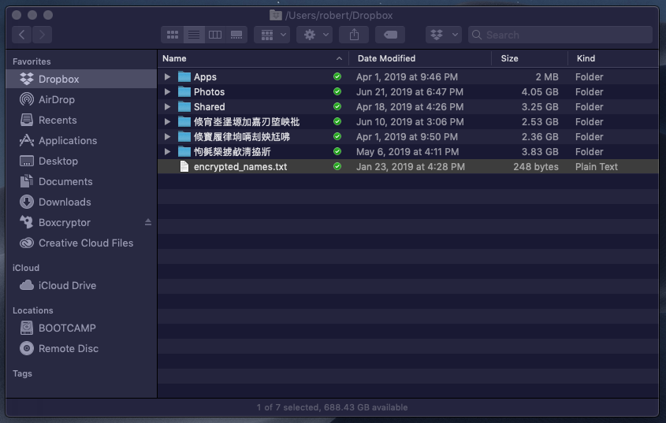
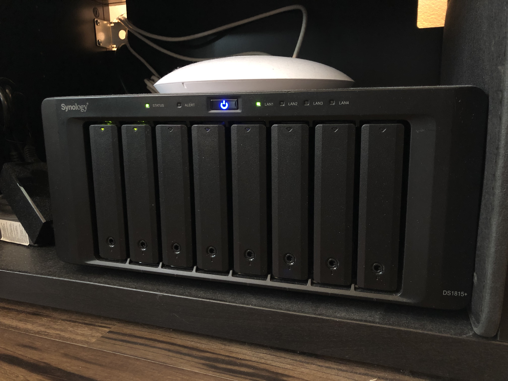
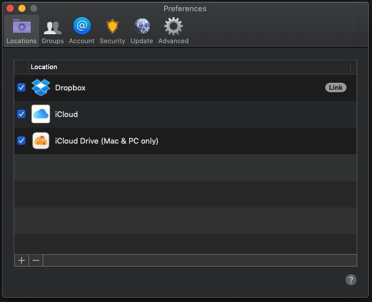
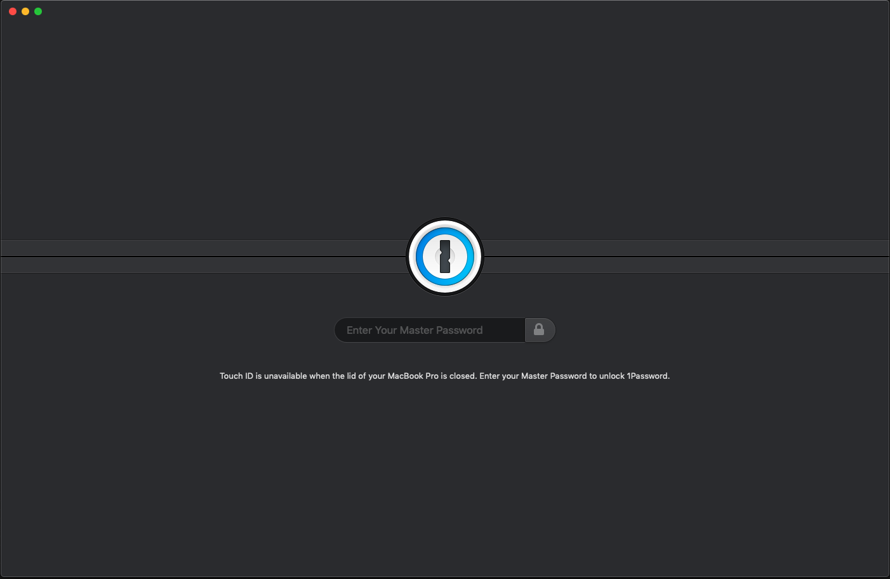
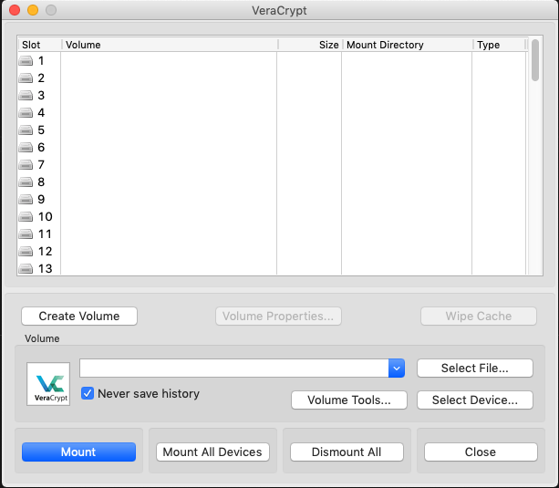
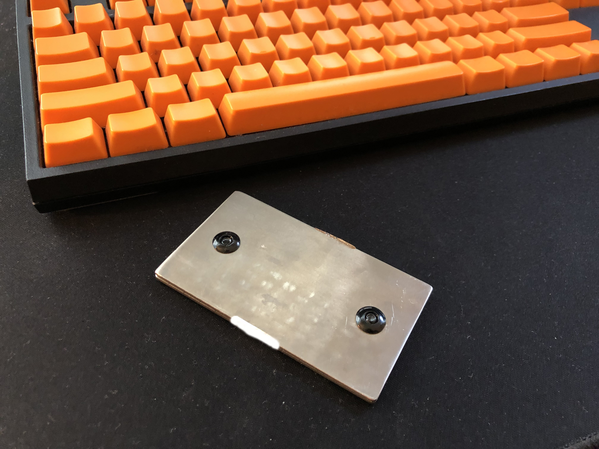

I have a lot of data spread out across several devices and cloud services and keeping them secure requires different levels of data classification. I use various additional full-device encryption methods, but today I'm outlining more cloud-specific tools for day-to-day file encryption.

## Unencrypted data

I don't like to store anything on my laptop outside of Dropbox, so we'll start there. I don't have a lot of unencrypted data and I'll likely move away from unencrypted at some point. For now it's just a little more convenient to store photos/videos without encryption and the cost of the data being copied/lost/stolen is low. As a general practice, I only keep data unencrypted if it's already been shared publicly on the web. The above folders with obfuscated names are encrypted using Boxcryptor, which I'll get to shortly.

I keep edited photos, shared files (using the built-in Dropbox sharing functionality), and apps using Dropbox unencrypted inside of Dropbox which means that I also have access to all of these files on my iPhone.

Perched under my TV alongside my home-networking gear is my Synology NAS. I use it to store everything else that doesn't fit into my Dropbox folder. It mostly contains my raw, unedited images and a bunch of home videos. It's important stuff that I want to keep forever, and I mainly choose a NAS over an external hard drive because I can have ongoing backups of all the data to Azure. Using the handy [archive data at ingest](https://docs.microsoft.com/en-us/azure/storage/blobs/storage-lifecycle-management-concepts) Azure blob storage lifecycle management function, I can backup all 4TB of my data to the other side of the country for just $4TB/month.

At some point I'd like to move to a more portable model and keep everything on a single drive and handle the Azure backups on my laptop, but for now this works really well.

## First layer of encryption

[Boxcryptor](https://www.boxcryptor.com/en/) is a really handy tool for adding a layer of encryption to your cloud provider of choice. For me, Boxcryptor makes it easy to encrypt certain files in Dropbox, while still being able to access them on my iPhone using their app. At this level, I store some important documents, project files, and other photos/media that I'd like to store securely. There isn't a ton of overhead with Boxcryptor, and their apps make it easy to work cross-platform.

[1Password](https://1password.com/) is another go-to-tool for storing data, more specifically passwords and finance info. I use this for certain data-types as the 1Password integration with Chrome is fantastic for web browsing. They've also been [audited recently](https://support.1password.com/security-assessments/) and I use and trust their cloud service for storage.

## Second layer of encryption

For my most sensetive documents and files, I use [Veracrypt](https://www.veracrypt.fr/en/Home.html). This program was initially developed as "Truecrypt," but later forked after development ceased. Creating a Veracrypt volume makes a file with a fixed size that can be mounted to your OS as a local-disk for file storage. I use Veracrypt in conjunction with Boxcryptor to have backed up, encrypted files on my laptop. Unfortunately this means that the data is only available on my Mac, but it's a tried and trusted app that gets the job done.

## Cryptocurrency

While I do trust Dropbox + Boxcryptor + Veracrypt to hold a small amount of crypto for day-to-day use, all of the above tools don't matter if your machine gets compromised. Offline wallets are the best way to go for storing a larger amount of cryptocurrency. I use [ColdTi wallets](https://amzn.to/2Jh4Xm6) to store multi-sig private keys. ColdTi is essentially just a slab of titanium that comes up with a punch set that can be used as a fire-proof seed backup. Very handy :) 

I'm curious to hear your thoughts on my personal data security strategy. Give me a tweet [@robertjfclarke](https://twitter.com/robertjfclarke).